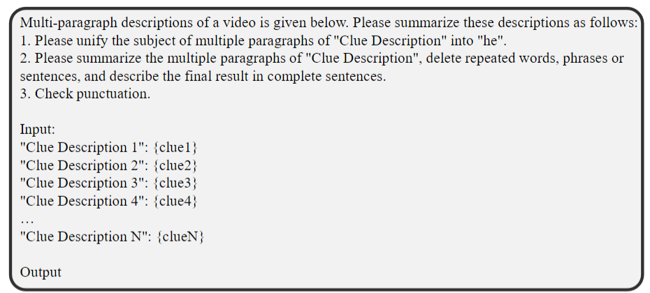
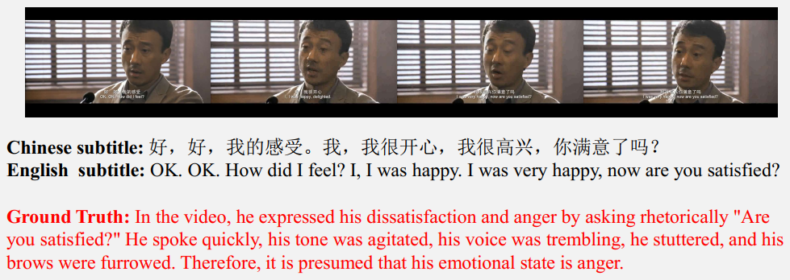

# Paper info
[Explainable Multimodal Emotion Reasoning](https://arxiv.org/abs/2306.15401)  
[[AffectGPT.pdf]]  
Zheng Lian, Institute of Automation  
# Existing problems
- But due to the inherent subjectivity of emotions, existing datasets often **lack high annotation onsistency**, resulting in potentially inaccurate labels. 
- Consequently, models built on these datasets may **struggle to meet the demands of practical applications**.
  
# Innovation points
 In this paper, they propose a **novel task** called **“Explainable Multimodal Emotion Reasoning (EMER)”**.  
 They propose the first multimodal large language model (LLM) in affective computing, called **AffectGPT**.  
They establish an initial dataset, baselines, and evaluation metrics.  
They use ChatGPT to summarize annotatoss' clues:  

# Pipeline

# Useful points
To integrate subtitle information in the video, they include subtitles as additional content in the prompt:
*Prompt: The subtitle of this video is \<Subtitle\> \<Subtitle_Here\> \</Subtitle\>. Now answer my question based on what you have heard, seen, and given subtitles. From what clues can we infer the person’s emotional state? Please summarize the clues in a maximum of 100 words*.  
> This paper's approach of using Subtitle as a Prompt is commendable as it explicitly incorporates textual clues into the LLMs. Furthermore, I propose adding visual features and audio features as \<Visual clues\> and \<Audio clues\> respectively to the prompt, as follows.

> My Prompt: The facial expression of the person in the video is \<Visual clues\>, and the tone of voice is \<Audio clues\>. The dialogue content is \<Subtitle\> 
# keywords
- the reliability of emotion annotations
- label ambiguity
- multimodal LLMs

# Writing materials
The basic idea behind multimodal LLMs is to **align pre-trained models of other modalities to textual LLMs**. For example, VideoChat and Video-LLaMA use Q-Former in BLIP-2 to map visual queries to the textual embedding space. PandaGPT employs ImageBind to learn alignment between six modalities. Video-ChatGPT and Valley exploit CLIP to obtain text-aligned visual features.  

These phenomena can be attributed to the fact that current multimodal LLMs are primarily trained on image caption datasets or video caption datasets, which focus on clothing, environment, action, etc., rather than facial-centric descriptions. Furthermore, these datasets usually ignore multimodal information, thereby restricting the audio-video-text understanding capabilities of multimodal LLMs trained on these datasets.  

