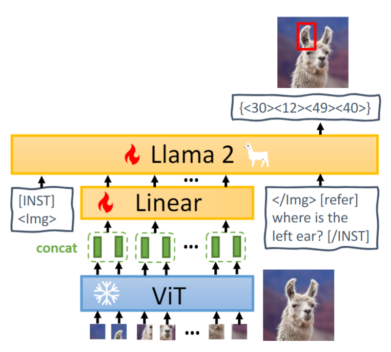
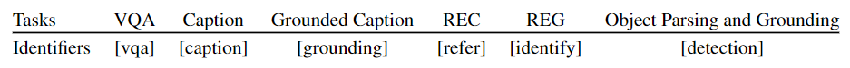

# Paper info
[MiniGPT-v2: Large Language Model As a Unified Interface for Vision-Language Multi-task Learning](https://github.com/Vision-CAIR/MiniGPT-4)  
[[MiniGPT-v2.pdf]]  
Jun Chen, Deyao Zhu, KAUST / Meta AI Research

# Existing problems
- The challenge is to use **a single model** for performing **diverse vision-language tasks** effectively with simple multi-modal instructions.
- due to the complexities inherent among different tasks
- the multimodal model might fail to distinguish each task by just aligning visual tokens to language models

# Innovation points
They propose using **unique identifiers** for different tasks when training the model.  
They propose a **task-oriented** instruction training scheme to reduce the multi-modal instructional ambiguity, and a vision-language model, MiniGPT-v2.

# Pipeline

# Useful points
Multi-task Instruction Template

>Add new task 'Affect' and new Identifiers 'affect' to achieve emotion recognition. We can add new tasks to the existing model for pretraining or finetuning, or we can pretrain a unified emotion recognition model from scratch.
# keywords
- A unique task identifier token for each task
- Multi-task Instruction Template

# Writing materials
A key feature of multimodal large language models is that they can **inherit advanced capabilities** (e.g., logical reasoning, common sense, and strong language expression) from the LLMs.  

In our work, the language model is treated as **a unified interface** for various vision-language inputs.   

When input instructions have task identifier tokens, our model will become **more prone to** multiple-task understanding during training.   

The first stage is to help MiniGPT-v2 **build broad vision-language knowledge**, .......  
To **have** **broad vision-language knowledge**, ......
# Extended literature
Blip2