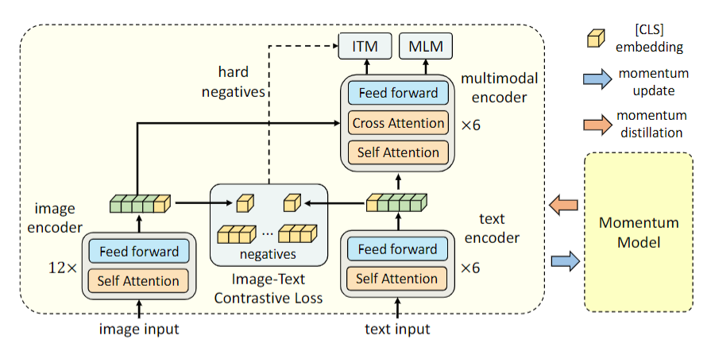

# Paper info
[Align before Fuse: Vision and Language Representation Learning with Momentum Distillation](https://arxiv.org/abs/2107.07651)  
[[ALBEF.pdf]]  
Junnan Li, Caiming Xiong, Steven C.H. Hoi  
NeurIPS 2021 Spotlight (Salesforce Research).  

# Existing problems
- Because the visual tokens and word tokens are unaligned, it is challenging for the multimodal encoder to learn image-text interactions.  
- The image features and the word token embeddings reside in their own space.
- The object detector is both annotation-expensive and compute-expensive.  
- The web image-text datasets are inherently noisy.  

# Innovation points
They introduce **a contrastive loss** to ALign the image and text representations BEfore Fusing (ALBEF) them through **cross-modal attention**.
To improve learning from noisy web data, they propose momentum distillation.  

# Pipeline

# Useful points
- Using a multimodal encoder to fuse the image features with the text features through **cross-modal attention**.  
- ITC, ITM, MLM loss.  

# keywords
- learn image-text interactions
- grounded vision and language representation learning
- a mutual information maximization perspective
- Vision-and-Language Pre-training (VLP) 

# Writing materials

# Extended literature