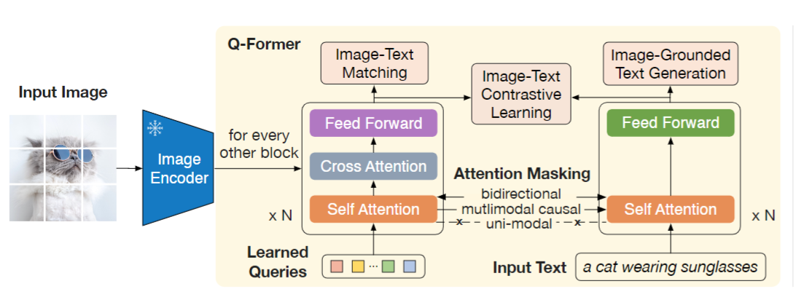
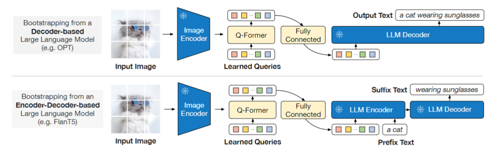

> 2023-12-07
# Paper info
[BLIP-2: Bootstrapping Language-Image Pre-training with Frozen Image Encoders and Large Language Models](https://arxiv.org/abs/2301.12597)  
[[Blip-2.pdf]]  
Junnan Li, Steven Hoi, Salesforce Research, 

# Existing problems
- The cost of vision-and-language pre-training
- the gap between a frozen image encoder and a frozen LLM

# Innovation points
They propose a Querying Transformer (Q-Former) pre-trained with a new two-stage pre-training strategy.   

ITC + ITG + ITM  
# Pipeline

  

  
  
# Useful points
- Q-Former

# keywords
- the modality gap

# Writing materials
We also demonstrate the model’s **emerging capabilities of zero-shot** image-to-text generation that can follow natural language instructions.  

To reduce computation cost and **counteract** the issue of **catastrophic forgetting**, the unimodal pre-trained models remain frozen during the pre-training.  

The queries **interact with** each other through self-attention layers, and **interact with** frozen image features through cross-attention layers (inserted every other transformer block).   

The projected query embeddings are then **prepended to the input text embeddings**. They function as **soft visual prompts** that condition the LLM on visual representation extracted by the Q-Former.  

# Extended literature
- I don't know the queries how to interact with the text through the same self-attention layers. The [code](https://github.com/salesforce/LAVIS/tree/main/projects/blip2) of Blip-2.
- Align before fuse: Vision and language representation learning with momentum distillation. In NeurIPS, 2021.
- Hallucination / Lossy Compression