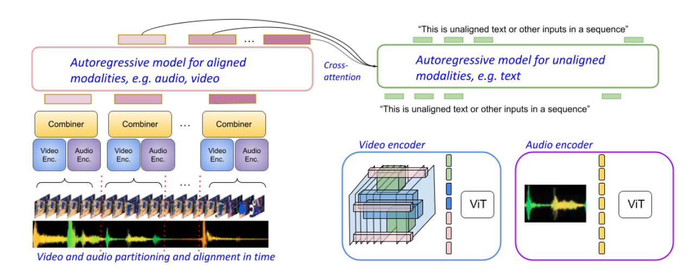

# Paper info
[Mirasol3B: A Multimodal Autoregressive model for time-aligned and contextual modalities](https://arxiv.org/abs/2311.05698)  
[[Mirasol3B.pdf]]  
AJ Piergiovanni*, Isaac Noble*, Google DeepMind  
# Existing problems
- combine hetero- geneous modalities
- modeling of long-range dependencies harder

# Innovation points
They propose to further partition the video and audio sequences in consecutive snippets and autoregressively process their representations.  
They propose a Combiner mechanism, which models the audio-video information jointly within a timeframe.  

# Pipeline

# Useful points

# keywords
- the time-synchronized modalities (audio and video) / the context modalities
- the time-aligned modalities / non-time-aligned contextual modalities
- raw spatio-temporal signals
- long-form video understandin

# Writing materials
However, **the imbalance of the information volume** is large and models which are well suited to encode/decode text sequences process only highly compressed image or video feature.  

Alternatively, methods that process the video running **each frame** independently through an encoder or tokenizer, reach an **upper bound** on the number of frames quickly . For longer inputs, these representations are insufficient to properly represent the modalities, which inherently limits the ability **to model fine-grained or long-range dependencies**.  

We extract **low level spatio-temporal representation** from the raw media inputs in order to capture the **dynamic nature** of videos in a **high-level representation** and combine it with audio features within concurrent timesteps.  

# Extended literature
 [Contrastive audio-visual masked autoencoder](https://arxiv.org/abs/2210.07839). In ICLR, 2023